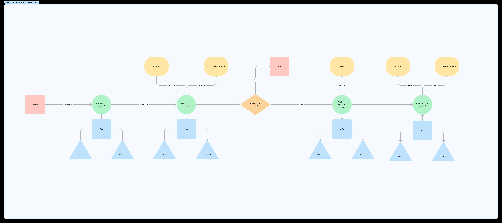

# Flash-Loan-Arbitrage-Bot_June2023

## Description

The decentralized finance (DeFi) ecosystem offers numerous decentralized exchanges (DEXs) with varying liquidity and token prices. However, price discrepancies often exist between these platforms, creating arbitrage opportunities. Traditional arbitrage strategies require substantial capital, but they fall short in taking advantage of instant borrowing opportunities provided by flash loans.

## Components

### Flash Loan Arbitrage Bot

The main entry point of the system. It coordinates the interaction between the different components and manages the overall flow of the arbitrage process.

### Arbitrage Engine

This component fetches market data from various decentralized exchanges (DEXs) and analyzes the prices to identify profitable arbitrage opportunities.

### Flash Loan Handler

Once an arbitrage opportunity is detected, this component initiates a flash loan by interacting with a flash loan provider smart contract. It borrows the necessary funds for executing the trades.

### Trade Executor

This component interacts with the identified DEXs to execute the sequence of trades required to take advantage of the price discrepancies. It handles the buying and selling of tokens to maximize the profit.

### Repayment Handler

After executing the trades, this component ensures that the borrowed funds, including any fees, are repaid to the flash loan provider contract within the same transaction. It handles the repayment process.

## [Figma](https://www.figma.com/file/mzUf9YeiZHsMv8zQSkNx87/flash-loan-arbitrage-bot?type=whiteboard&node-id=0%3A1&t=TvfSawJxSZboi2q6-1)
